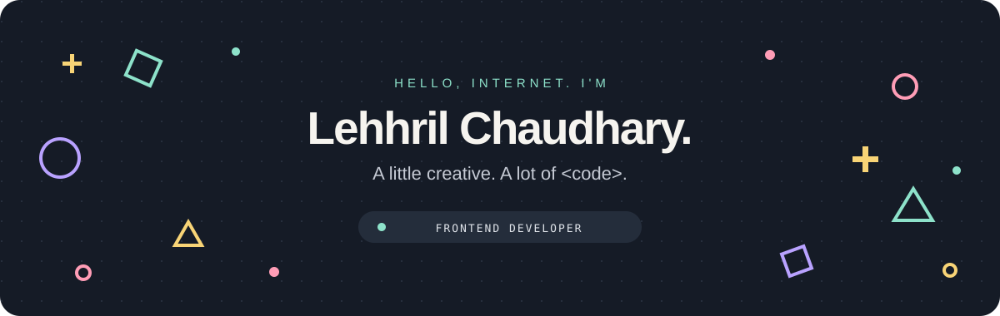
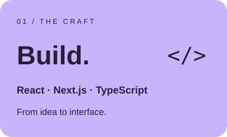
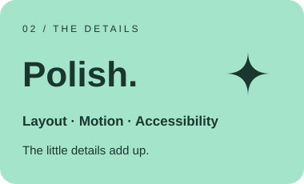
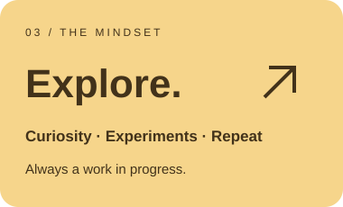

<p align="center">
  
</p>

<div align="center">

<p>
  
</p>

I turn designs into responsive, accessible web experiences.<br />
React, Next.js, and an eye for the details that make an interface feel right.

[](https://lehhril-portfolio.vercel.app/)
[](mailto:lehhril.w@gmail.com)

<sub>Based in Mohali, Punjab · Available for freelance work</sub>

</div>

<br />

<p align="center">
  
  
  
</p>

---

### 01 / The person behind the pixels

I'm **Lehhril Chaudhary**, a frontend developer who enjoys bringing ideas to life with React, Next.js, and TypeScript. I'm into thoughtful interfaces, reusable components, and the small details that make the web feel good to use.

```tsx
const lehhril = {
  role: "Frontend Developer",
  basedIn: "Mohali, Punjab",
  stack: ["React", "Next.js", "TypeScript"],
  caresAbout: ["accessibility", "performance", "the last 2px"],
  curiosity: Infinity,
  status: "a work in progress — just like the web",
};
```

> My kind of UI: easy to use, hard to stop tweaking.

### 02 / The tools behind the good stuff

<p>
  
</p>

<details>
<summary>A peek inside the toolbox ↗</summary>

| What I work on | What I reach for |
| :--- | :--- |
| Interfaces & rendering | React · Next.js · SSR · SSG · ISR |
| Styling | Tailwind CSS · SCSS · Bootstrap |
| State & data | Redux · Zustand · Context · REST APIs |
| Confidence in the code | Jest · React Testing Library · Zod |
| Components & delivery | Storybook · Figma · GitHub Actions · Vercel |

</details>

<details>
<summary>Inspect element: the human edition</summary>

<br />

**Design brain:** Could that spacing be a little better?<br />
**Developer brain:** This should be a reusable component.<br />
**Browser:** You have 27 tabs open.<br />
**Me:** They're all essential.

<sub>No console errors were intentionally left behind.</sub>

</details>

### 03 / Let's connect

Into frontend, design, or making cool things for the web? Say hello.

**[Explore my portfolio ↗](https://lehhril-portfolio.vercel.app/)** · **[Get in touch ↗](mailto:lehhril.w@gmail.com)**

---

<div align="center">
  <sub>Made with curiosity & a few too many tabs.</sub>
</div>
